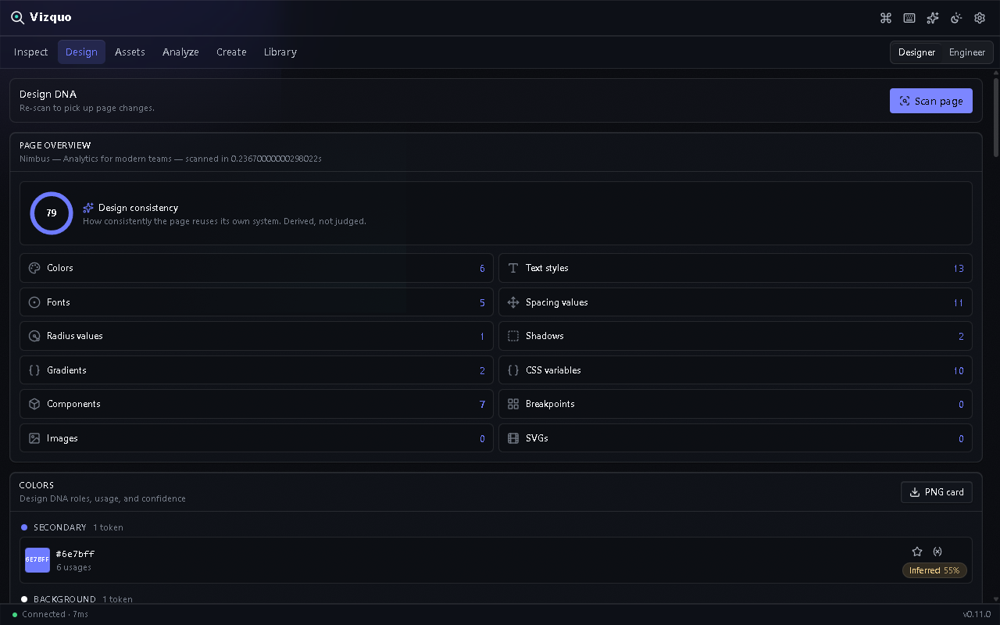
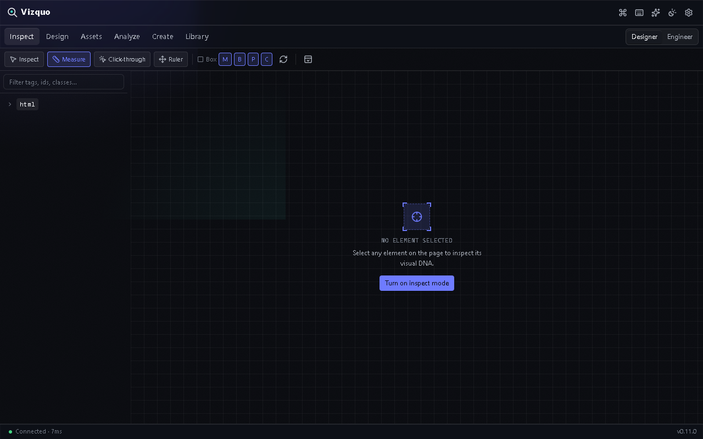
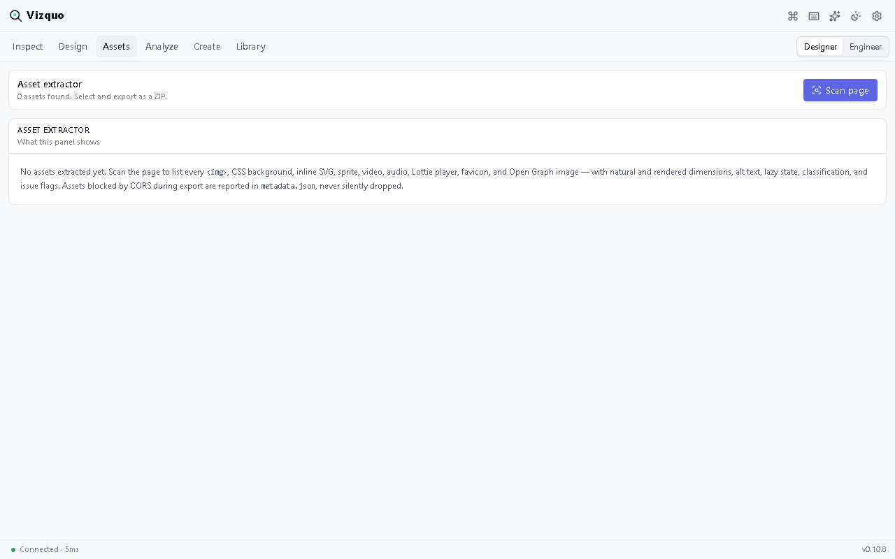

<p align="center">
  
</p>

<h1 align="center">Vizquo</h1>

<p align="center">
  <strong>Inspect anything. Understand everything. Build faster.</strong><br>
  A design-intelligence layer for the web — inspect a live page and extract its
  visual system, with every value traced back to its source.
</p>

<p align="center">
  <a href="https://github.com/WebDclassified/vizquo/actions/workflows/ci.yml">
    
  </a>
  
  
  
  
</p>

---

## What is Vizquo?

Vizquo is a browser extension side panel for designers and frontend developers.
Point it at any webpage and it extracts the site's **design DNA** — colors,
typography, spacing, radius, components, and assets — every value labeled with
its confidence (**Detected / Derived / Inferred**) and traced back to the CSS
rule, stylesheet, and line that produced it.

It is **not** a CSS inspector, not a screenshot tool, and not a scraper. It is
a lens into the visual system of the web: *Inspect → Understand → Extract →
Rebuild.*

## Screenshots

| Design overview | Element inspector | Assets |
|---|---|---|
|  |  |  |

## Features

- **Element inspector** — computed styles, CSS cascade & specificity, variable
  chains, box-model diagram, DOM tree, and plain-language Designer summaries
  with a *Show CSS* toggle (Designer ⇄ Engineer modes).
- **Design DNA** — automatic color roles, typographic hierarchy, spacing /
  radius / shadow scales, CSS variables, and a design-consistency score (0–100)
  with click-to-highlight on the real page.
- **Asset extraction** — images, SVGs, icons, backgrounds, video posters and
  more, deduped and classified; an SVG inspector with SVG → React conversion;
  one-click bulk ZIP export.
- **Screenshot studio** — viewport, element, full-page and multi-selection
  captures.
- **Code generation** — turn any element into **React, Vue, Svelte, HTML, or
  Tailwind** code; export design tokens to **CSS, SCSS, Tailwind, JSON, TS,
  Figma Tokens, and Style Dictionary**.
- **Audits** — WCAG contrast with exact luminance math, performance, and
  accessibility findings, anchored to their elements.
- **Responsive Time Machine** — see the layout at any viewport width via
  real iframe emulation.
- **Library** — scan history, per-page version timeline with diff summaries,
  collections, notes, comparison, and printable reports.
- **Command palette** (Ctrl/⌘K) and omnibox commands (`viz scan`, `viz
  inspect`, …) for keyboard-first workflows.
- **Optional AI** — "Why?" element explanations and design-system summaries via
  free OpenRouter models or a fully-local Ollama. Off by default, consent-gated.

## Privacy

- **Local by default.** Scans, screenshots, and your library live only in your
  browser (IndexedDB). No account, no tracking, no analytics — and **zero
  network requests** until you choose otherwise (the UI loads no external
  fonts, scripts, or resources).
- **On-demand access.** Site access is granted per-site, on demand — never at
  install. Cross-origin iframes and closed Shadow DOM are honestly labeled,
  never bypassed.
- **AI is opt-in and bounded.** Disabled by default; shows exactly what it will
  send before the first request; payloads are redacted (no input values, no
  data attributes). You can use a local model that never leaves your machine.

See [`PRIVACY.md`](PRIVACY.md) and [`SECURITY.md`](SECURITY.md) for details.

## Install

> Store listings are in progress — links appear here when live.

**Chrome / Edge** — install from the Chrome Web Store / Edge Add-ons, or load
the unpacked build:

```sh
npm install
npm run build        # production build → .output/chrome-mv3
```

1. Open `chrome://extensions` (or `edge://extensions`) → enable **Developer mode**.
2. **Load unpacked** → select `.output/chrome-mv3`.
3. Pin Vizquo, open the side panel, and grant access to a tab when prompted —
   that is how it connects: always on demand, never by default.

**Firefox** — `npm run build:firefox:mv3`, then load `.output/firefox-mv3` via
`about:debugging#/runtime/this-firefox` (temporary add-on).

## Development

```sh
npm install
npm run dev            # Chrome dev build with HMR
npm run dev:firefox    # Firefox dev build
npm run compile        # strict tsc
npm run lint           # Biome
npm run test           # vitest unit suite
npm run test:e2e       # Playwright E2E (needs `npm run build` first)
npm run zip            # store-ready ZIP → .output/
```

Validation gate before shipping: `compile → lint → test → build → test:e2e`.

Store assets (promo tiles + real panel screenshots) are generated by scripts:

```sh
node scripts/generate-promo-tile.mjs    # → deploy-kit/promo/
node scripts/capture-screenshots.mjs    # → deploy-kit/screenshots/ (add CAPTURE_WIDTH=420 for side-panel shots)
```

## Tech stack

| Concern | Pick |
|---|---|
| Extension framework | **WXT** (Vite-based, MV3, cross-browser) |
| UI | **SolidJS** (fine-grained reactivity for live property rows) |
| Primitives | **Kobalte** (accessible dialog, combobox, tabs, tooltip, toast) |
| Styling | **UnoCSS** + CSS custom properties |
| Local persistence | **Dexie / IndexedDB** behind a repository interface |
| Messaging | **@webext-core/messaging** (typed RPC) |
| Worker offloading | **Comlink** |
| CSS parsing | **css-tree** · Color science **culori** · ZIP export **fflate** |
| AI | **OpenRouter** (free `:free` models) + **Ollama** (fully local) |
| Tests | **Vitest** + **Playwright** · Lint/format **Biome** |

## Documentation

- [`ARCHITECTURE.md`](ARCHITECTURE.md) — folder layout, stores, caching tiers
- [`PERMISSIONS.md`](PERMISSIONS.md) — every manifest permission and why
- [`SECURITY.md`](SECURITY.md) — page content treated as untrusted input
- [`PRIVACY.md`](PRIVACY.md) — what leaves the browser (nothing, except opt-in AI)
- [`DATA_MODEL.md`](DATA_MODEL.md) — the normalized entity types
- [`TESTING.md`](TESTING.md) — test matrix and how to run it
- [`CHANGELOG.md`](CHANGELOG.md) — release notes (also powers the in-app
  "What's new" dialog)
- [`DECISIONS.md`](DECISIONS.md) — running log of non-obvious choices

## License

[MIT](LICENSE)
